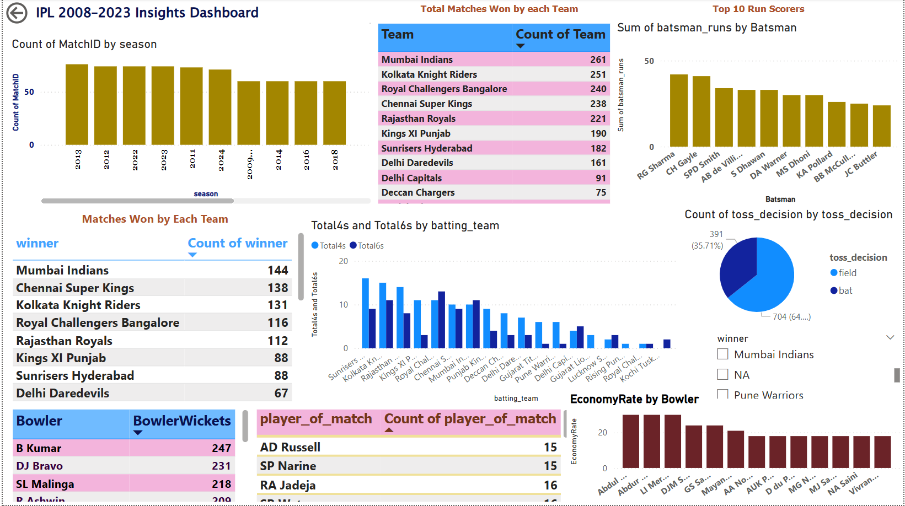

# 🏏 IPL Data Analyst Case Study

A complete end-to-end IPL Data Analysis project using **Python (Pandas, Matplotlib), SQL (MySQL), Power BI, and Excel**.

## 📁 Tools & Technologies Used:
- Python (Pandas, NumPy, Matplotlib)
- MySQL for SQL Queries
- Microsoft Power BI for Dashboards
- MS Excel (Pivot Tables)
- Jupyter Notebook, GitHub

## 📊 What I Did:
- Cleaned and analyzed IPL match and ball-by-ball datasets
- Performed EDA on players, teams, toss, seasons, scores, economy, etc.
- Wrote over 30+ SQL queries to find top batters, bowlers, match outcomes
- Built an interactive Power BI Dashboard
- Created visualizations using matplotlib in Python

## 🔍 Key Insights:
- Top teams with most wins
- Top 10 run scorers and wicket takers
- Toss impact on match outcomes
- Most economical bowlers (Min 50 overs)
- Total 4s and 6s by teams

## 📸 Power BI Dashboard:

## 📂 Files in this Repo:
| File | Description |
|------|-------------|
| `IPL_EDA1.ipynb` | Python code for EDA |
| `IPL_Project_SQL_Stuff` | SQL analysis scripts |
| `IPL_Project_Dashboard.png` | Screenshot of dashboard |
| `README.md` | Project description |

## 📎 Dataset Source:
[IPL Dataset on Kaggle](https://www.kaggle.com/datasets/patrickb1912/ipl-complete-dataset-20082020))

---

## 🙋‍♂️ Author: Shivaram Rathod

🎓 Aspiring Data Analyst | Python • SQL • Power BI  • Excel
🔗 [LinkedIn Profile](https://www.linkedin.com/in/shivaram-rathod-387a982a3)  
💻 [GitHub Portfolio](https://github.com/shivaram63)
